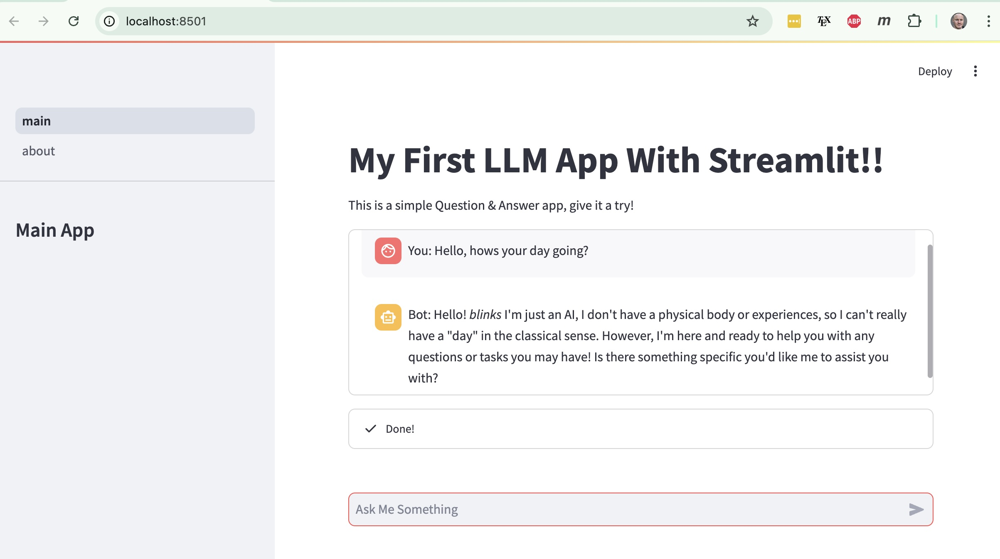

# Second Streamlit LLM App
---------------------------

## About
---------
This is a pretty simple app and builds off my [first app](https://github.com/mdh266/firstapp), it is a basic ChatBot using [Streamlit](https://streamlit.io/) as a front end and that queries [Llama3](https://www.llama.com/llama3/) using [Groq](https://groq.com/). 

Another difference is that I use [Docker](https://www.docker.com/) so that I can deploy the app to serverless platform like [Google Cloud Run](https://cloud.google.com/run)

You can see below,

## Using The App Locally
------------------------
You can build the docker image locally with the command,

    docker build -t secondapp .

You can then start up the webserver using the command,

    docker run -ip 8501:8501 -e GROQ_API_KEY='<your-api-key>' secondapp
